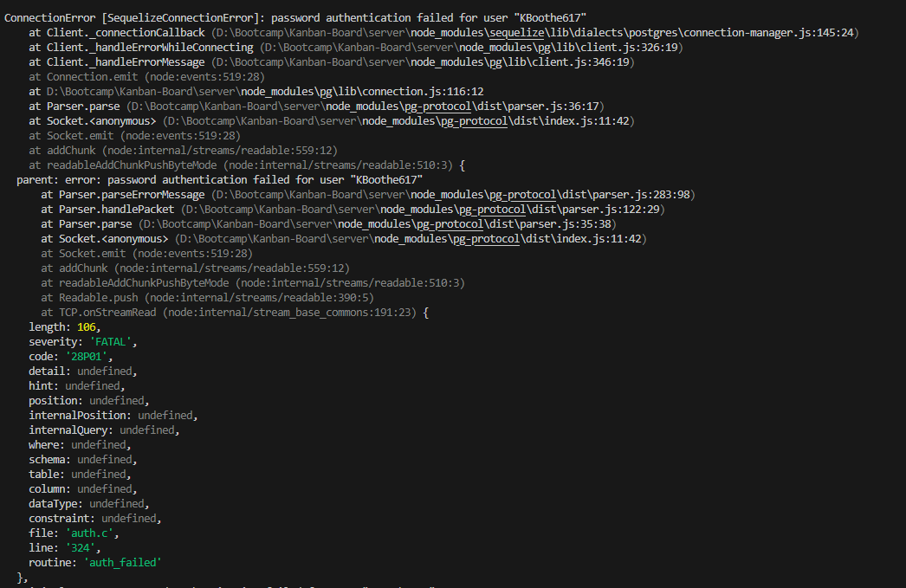

# Kanban-Board

- [Description](#description)
- [Installation](#installation)
- [Usage](#usage)
- [Credits](#credits)
- [Questions](#questions)
- [License](#license)
- [Tests](#tests)

## Description

Full stack Kanban Board

URL https://kanban-board-djp8.onrender.com

---

## Installation

npm install

---

## Usage

Kanban Board

---

## Tests

none

---

## Contribution guidelines

If you'd like to contribute, contact by email. I'm having issues with psql not taking my password for the db but it will when running psql in the terminal. If you know how to fix please let me know.

---

## Questions

If you have any questions, reach me on [github](https://github.com/KBoothe617)

or email me here at kboothe617@gmail.com

---

## License

Unlicense

---

